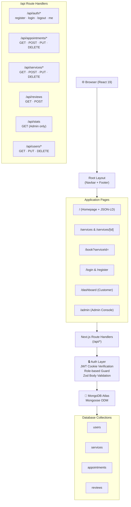
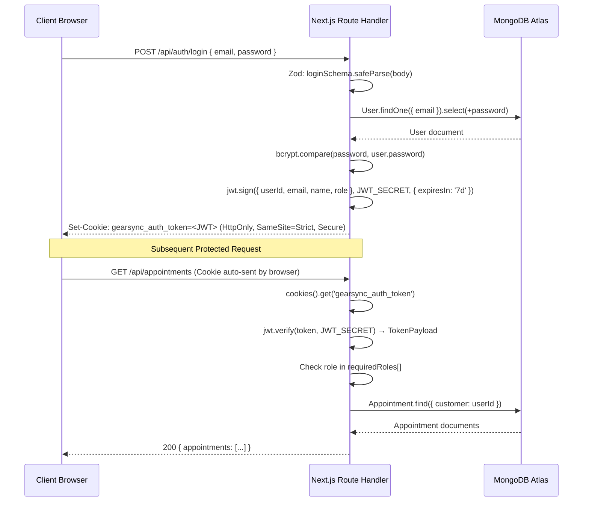
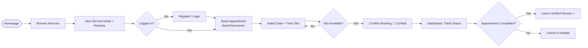
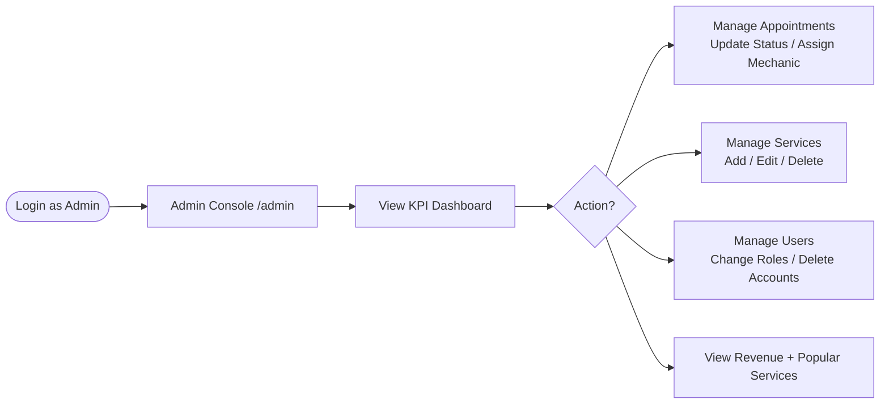

<div align="center">

<br/>

<br/><br/>

# GearSync
### Enterprise Auto Maintenance, Scheduling & Business Management Platform

**A commercial-grade, full-stack web application** delivering end-to-end vehicle service booking, mechanic dispatch, customer relationship management, and live business analytics — deployed for a real automotive services network in Melbourne, Australia.

<br/>

[](https://nextjs.org)
[](https://www.typescriptlang.org)
[](https://www.mongodb.com/atlas)
[](https://react.dev)
[](https://zod.dev)
[](LICENSE)

</div>

---

## 📑 Table of Contents

- [Overview](#-overview)
- [Problem Statement](#-problem-statement)
- [Solution](#-solution)
- [Key Features](#-key-features)
- [Technology Stack](#-technology-stack)
- [System Architecture](#-system-architecture)
- [Folder Structure](#-folder-structure)
- [Database Schema](#-database-schema)
- [API Reference](#-api-reference)
- [Authentication Flow](#-authentication-flow)
- [User Journeys](#-user-journeys)
- [UI Showcase](#-ui-showcase)
- [Security](#-security)
- [Performance & SEO](#-performance--seo)
- [Deployment](#-deployment)
- [Environment Variables](#-environment-variables)
- [Roadmap](#-roadmap)
- [License](#-license)
- [About the Author](#-about-the-author)

---

## 🌐 Overview

**GearSync** is a production-grade automotive services platform built for a vehicle service network operating in Melbourne, Australia. It replaces fragmented spreadsheets and phone-based scheduling with a centralized, automated, multi-role digital system that manages bookings, mechanics, billing visibility, and customer relationships — all from a single application.

> Built, maintained, and deployed by [Abdurrehman Narmawala](https://abdurrehman.co.in) as a bespoke commercial software engagement for an automotive services client.

---

## 🔍 Problem Statement

Traditional auto service businesses operate with fragmented, manual workflows:

- 📞 **Scheduling via phone calls** causes double-bookings and missed appointments
- 📋 **Paper-based job sheets** make it impossible to track status in real time
- 🔒 **No customer portal** means clients call repeatedly to check progress
- 📊 **Zero analytics** — owners have no visibility on revenue, popular services, or staff utilization
- ⭐ **No review system** — feedback collection is informal, unverifiable, and unstructured

---

## 💡 Solution

GearSync replaces the chaos with a purpose-built, role-aware digital platform:

| Challenge | GearSync Solution |
|-----------|-------------------|
| Double bookings | Real-time slot conflict detection before DB write |
| No client portal | Customer dashboard with live booking status |
| Manual status updates | Dispatcher interface for admins/mechanics |
| Zero revenue visibility | Aggregated revenue KPIs from completed appointments |
| Unverified reviews | Verified buyer gate — requires `completed` appointment |
| No role separation | RBAC with `customer`, `mechanic`, and `admin` scopes |

---

## ✨ Key Features

### 🔐 Identity & Access Control (RBAC)
- **Bcrypt password hashing** with 10 salt rounds (`bcryptjs`)
- **JWT session tokens** signed with HS256, stored in `HttpOnly` / `SameSite=Strict` / `Secure` cookies — inaccessible to JavaScript, preventing XSS
- **7-day rolling sessions** with automatic expiry
- **Role-based route guards** at both layout and API handler layers:
  - `customer` → personal appointment dashboard, booking, and reviews
  - `mechanic` → assigned appointment queue
  - `admin` → full platform control, stats, user management
- **First-user bootstrap**: The first registered account is automatically assigned `admin` role
- **Admin self-lockout protection**: Admins cannot modify their own role or delete their own account

### 📅 Smart Scheduling Engine
- **Four fixed daily time slots**: `09:00 AM`, `11:00 AM`, `02:00 PM`, `04:00 PM`
- **Live conflict detection**: Before creating any booking, the system queries for existing non-cancelled appointments for the same service on the same day and slot — preventing double bookings at the database level
- **Past-date guard**: Zod validation rejects any booking date in the past before the request reaches the database
- **Service pre-selection funnel**: Browsing `/services/[id]` passes the service ID as a query parameter directly into the booking form

### 📊 Administrative Business Console
- **Live KPI cards**: Total appointments, total customers, total mechanics, and cumulative revenue from completed services
- **MongoDB Aggregation Pipelines**:
  - `$group` by appointment `status` → status distribution breakdown
  - Revenue calculation: `completed` appointments populated with service prices summed in-memory
  - Top-3 popular services: `$group → $sort → $limit` aggregation pipeline, re-populated with service names
- **Recent activity feed**: Last 5 appointments with full customer/service population
- **Admin Dispatcher View**: Real-time appointment status updates (pending → confirmed → in-progress → completed/cancelled)
- **Service Menu Manager**: Full CRUD on the services catalog with form validation
- **User & Role Manager**: Admin-controlled role changes, account status, and deletion (with self-protection guard)

### ⭐ Verified Customer Reviews
- **Verified purchase gate**: Review creation requires at least one `completed` appointment for the specific service in the requesting customer's history — enforced at the API layer, not just the UI
- **One review per customer per service**: Subsequent review submissions update rather than duplicate
- **Rating aggregation**: `$avg` MongoDB aggregation pipeline returns live average ratings alongside review lists
- **Population**: Review list responses populate customer `name` for display

### 🌟 Customer Dashboard
- Personal appointment timeline with full service/mechanic details
- Appointment status badges: `pending`, `confirmed`, `in-progress`, `completed`, `cancelled`
- Self-serve cancellation (only for non-completed/non-cancelled appointments)
- Direct links to book new services

### 🎨 Premium UI/UX Design
- **Dual typography system**: `Chakra Petch` (headings/UI labels) + `Mulish` (body text) — Google Fonts via `next/font`
- **Material Symbols Rounded** iconography via Google Fonts CDN
- **Lucide React** icons for admin interface
- **Canvas Confetti** celebration animation on successful booking
- **Dark theme design system** with custom CSS HSL variables
- **Fully responsive** layout across mobile, tablet, laptop, and desktop breakpoints
- **Admin sidebar** collapses to horizontal nav on `max-width: 991px`

---

## 🛠️ Technology Stack

| Layer | Technology | Version |
|-------|-----------|---------|
| Framework | Next.js (App Router) | 16.2.10 |
| Language | TypeScript (strict mode) | 5.x |
| Runtime | React | 19.2.4 |
| Database | MongoDB Atlas + Mongoose ODM | 7.x / 9.x |
| Authentication | `jsonwebtoken` + `bcryptjs` | 9.x / 3.x |
| Validation | Zod | 4.4.3 |
| Icons | `lucide-react` + Material Symbols | 1.24 |
| Animation | `canvas-confetti` | 1.9.4 |
| Styling | Vanilla CSS (custom design system) | — |
| Build Tool | Turbopack (Next.js built-in) | — |
| Font Loading | `next/font/google` | — |
| SEO | Schema.org JSON-LD, Dynamic Sitemap | — |
| PWA | `manifest.ts` (Next.js manifest API) | — |

---

## 🏗️ System Architecture



---

## 📁 Folder Structure

```
gearsync/
├── public/
│   └── assets/
│       └── images/          # Logo, hero banner, service images
├── src/
│   ├── app/                 # Next.js App Router pages
│   │   ├── layout.tsx       # Root layout (Navbar, Footer, fonts, metadata)
│   │   ├── page.tsx         # Homepage (hero, services, reviews, JSON-LD)
│   │   ├── globals.css      # Global design system (CSS variables, tokens)
│   │   ├── manifest.ts      # PWA Web App Manifest
│   │   ├── sitemap.ts       # Dynamic sitemap (static + DB service routes)
│   │   ├── robots.ts        # Robots.txt config (blocks /admin, /api)
│   │   ├── favicon.ico      # Browser favicon
│   │   ├── login/           # Login page
│   │   ├── register/        # Registration page
│   │   ├── dashboard/       # Customer dashboard
│   │   ├── services/        # Services catalog + [id] detail page
│   │   ├── book/            # Booking wizard
│   │   └── admin/           # Admin console
│   │       ├── layout.tsx   # Admin layout (auth guard + Sidebar)
│   │       ├── page.tsx     # Admin overview (KPIs + analytics)
│   │       ├── appointments/# Dispatcher view + status management
│   │       ├── services/    # Service menu CRUD
│   │       └── users/       # User & role management
│   ├── components/          # Shared UI components
│   │   ├── Navbar.tsx
│   │   ├── Footer.tsx
│   │   ├── Sidebar.tsx      # Admin nav sidebar
│   │   └── Toast.tsx        # Notification toast system
│   ├── lib/                 # Server-side utilities
│   │   ├── db.ts            # MongoDB Atlas connection (singleton)
│   │   ├── auth.ts          # JWT sign/verify, bcrypt, cookie management
│   │   ├── validation.ts    # Zod schemas (register, login, service, appointment, review)
│   │   ├── logger.ts        # Structured logger (info/warn/error + timestamps)
│   │   └── models/          # Mongoose models
│   │       ├── User.ts
│   │       ├── Service.ts
│   │       ├── Appointment.ts
│   │       └── Review.ts
│   └── app/api/             # REST API route handlers
│       ├── auth/            # register · login · logout · me
│       ├── appointments/    # CRUD + slot availability
│       ├── services/        # Service catalog CRUD
│       ├── reviews/         # Review POST + aggregated GET
│       ├── stats/           # Admin KPI aggregations
│       └── users/           # User management (Admin)
├── .env.local               # Environment config (not committed)
├── next.config.ts           # Next.js configuration
├── tsconfig.json            # TypeScript configuration
└── package.json
```

---

## 🗄️ Database Schema

### `users`
| Field | Type | Constraints |
|-------|------|------------|
| `name` | String | Required, max 50 chars |
| `email` | String | Required, unique, lowercase, regex validated |
| `password` | String | Required, min 6 chars, `select: false` (never returned) |
| `role` | Enum | `customer` \| `mechanic` \| `admin`, default `customer` |
| `createdAt` / `updatedAt` | Date | Auto-managed by Mongoose `timestamps` |

### `services`
| Field | Type | Constraints |
|-------|------|------------|
| `name` | String | Required, unique, max 100 chars |
| `description` | String | Required, max 1000 chars |
| `price` | Number | Required, min 0 |
| `duration` | Number | Minutes, required, min 10, default 60 |
| `category` | String | Required |
| `image` | String | Asset path, default `/assets/images/services-1.png` |

### `appointments`
| Field | Type | Constraints |
|-------|------|------------|
| `customer` | ObjectId | Ref: `User`, required |
| `service` | ObjectId | Ref: `Service`, required |
| `mechanic` | ObjectId | Ref: `User`, optional |
| `date` | Date | Required |
| `timeSlot` | Enum | `09:00 AM` \| `11:00 AM` \| `02:00 PM` \| `04:00 PM` |
| `status` | Enum | `pending` \| `confirmed` \| `in-progress` \| `completed` \| `cancelled`, default `pending` |
| `notes` | String | Optional, max 500 chars |

### `reviews`
| Field | Type | Constraints |
|-------|------|------------|
| `customer` | ObjectId | Ref: `User`, required |
| `service` | ObjectId | Ref: `Service`, required |
| `rating` | Number | Min 1, max 5 |
| `comment` | String | Min 5, max 1000 chars |

---

## 📡 API Reference

All endpoints return `application/json`. Protected endpoints require a valid `gearsync_auth_token` HttpOnly cookie.

### Authentication — `/api/auth`

| Method | Endpoint | Auth | Description |
|--------|----------|------|-------------|
| `POST` | `/api/auth/register` | Public | Register new user. First user auto-assigned `admin`. |
| `POST` | `/api/auth/login` | Public | Authenticate and set JWT cookie. |
| `POST` | `/api/auth/logout` | Public | Clear session cookie. |
| `GET` | `/api/auth/me` | Cookie | Return current session user data. |

### Services — `/api/services`

| Method | Endpoint | Auth | Description |
|--------|----------|------|-------------|
| `GET` | `/api/services` | Public | List all services (with DB seeding on empty). |
| `POST` | `/api/services` | Admin | Create a new service. |
| `GET` | `/api/services/[id]` | Public | Fetch a single service by ID. |
| `PUT` | `/api/services/[id]` | Admin | Update an existing service. |
| `DELETE` | `/api/services/[id]` | Admin | Delete a service. |

### Appointments — `/api/appointments`

| Method | Endpoint | Auth | Description |
|--------|----------|------|-------------|
| `GET` | `/api/appointments` | Any role | Returns appointments scoped by role (customer → own; mechanic → assigned; admin → all). Filterable by `?status=`. |
| `POST` | `/api/appointments` | Any logged-in | Book a new appointment with double-booking guard. |
| `GET` | `/api/appointments/[id]` | Any role | Single appointment detail with full population. |
| `PUT` | `/api/appointments/[id]` | Any role | Update status (customers: cancel only; admins: any status). |
| `DELETE` | `/api/appointments/[id]` | Admin | Delete appointment record. |
| `GET` | `/api/appointments/slots` | Public | Return available time slots for a given service + date. |

### Reviews — `/api/reviews`

| Method | Endpoint | Auth | Description |
|--------|----------|------|-------------|
| `GET` | `/api/reviews?serviceId=` | Public | Fetch reviews + aggregated `averageRating` / `totalReviews` for a service. |
| `POST` | `/api/reviews` | Customer | Post or update a review. Requires a `completed` appointment for the service. |

### Analytics — `/api/stats`

| Method | Endpoint | Auth | Description |
|--------|----------|------|-------------|
| `GET` | `/api/stats` | Admin only | Returns KPI metrics, status distribution, top-3 popular services, cumulative revenue, and 5 most recent appointments. |

### Users — `/api/users`

| Method | Endpoint | Auth | Description |
|--------|----------|------|-------------|
| `GET` | `/api/users` | Admin | List all users with role information. |
| `PUT` | `/api/users/[id]` | Admin | Update user name or role (with self-protection guard). |
| `DELETE` | `/api/users/[id]` | Admin | Delete a user account (with self-protection guard). |

---

## 🔐 Authentication Flow



---

## 🚶 User Journeys

### Customer Journey



### Admin Journey



---

## 🖥️ UI Showcase

The application features a premium dark-themed design system powered by custom CSS HSL variables, two Google Fonts (`Chakra Petch` + `Mulish`), and Material Symbols Rounded iconography.

**Pages & Screens:**
- 🏠 **Homepage** — Hero banner, animated service cards, testimonial reviews, team section, FAQ accordion, and contact form with Schema.org JSON-LD structured data
- 🔧 **Services Catalog** — Filterable service grid with category badges, pricing, and duration
- 📋 **Service Detail** — Full description, duration/price info, customer reviews with aggregate rating, and booking CTA
- 📅 **Booking Wizard** — Date picker, real-time available time slot detection, optional notes field
- 👤 **Customer Dashboard** — Appointment timeline with status indicators, cancel controls, and review links
- 🛠️ **Admin Overview** — Live KPI summary cards, revenue tracker, appointment status distribution, top services, recent activity feed
- 📆 **Dispatcher View** — Full appointment table with status dropdown controls and mechanic assignment
- ⚙️ **Service Manager** — Admin CRUD form for service catalog with image path assignment
- 👥 **User & Role Manager** — User list with inline role editor and delete controls

---

## 🔒 Security

| Threat | Mitigation |
|--------|-----------|
| **XSS** | JWT stored in `HttpOnly` cookie — inaccessible to `document.cookie` or `localStorage` attacks |
| **CSRF** | `SameSite=Strict` cookie policy prevents cross-site request forgery |
| **SQL/NoSQL Injection** | All inputs pass through Zod schema validation before any DB operation; Mongoose ODM parameterizes all queries |
| **Password Exposure** | `bcryptjs` 10-round hashing; `select: false` on password field — never returned from DB queries |
| **Unauthorized Access** | `getAuthenticatedUser(requiredRoles[])` called at the start of every protected route handler |
| **Admin Privilege Escalation** | Server-side guard prevents admins from editing or deleting their own account |
| **Token Forgery** | JWTs verified with `jwt.verify(token, JWT_SECRET)` — tampered tokens return `null` and are rejected |
| **Invalid Data** | Every POST/PUT body parsed through Zod before reaching Mongoose — malformed requests return `400` before any DB call |

---

## 📈 Performance & SEO

### SEO Implementation
- **Schema.org JSON-LD**: Homepage emits `AutoRepair` (LocalBusiness) structured data including `telephone`, `address` (with `addressRegion` and `postalCode`), `openingHoursSpecification`, and `priceRange`
- **Dynamic Sitemap** (`sitemap.ts`): Combines static routes with live MongoDB service records to generate a complete `sitemap.xml` on every request
- **Robots.txt** (`robots.ts`): Disallows crawling of `/admin`, `/dashboard`, `/api/`, and `/login`/`/register`
- **Open Graph Tags**: Title, description, and a `1200×630` hero banner image for rich social previews
- **Canonical Metadata**: Per-page `<title>` and `<meta name="description">` via Next.js `Metadata` API

### PWA Configuration
- `manifest.ts` (Next.js Manifest API) defines app name, short name, theme color, background color, display mode (`standalone`), and icon sets for home screen installation

### Font Performance
- `next/font/google` with `display: swap` — zero layout shift on font load
- CSS variable injection (`--font-chakra-petch`, `--font-mulish`) for system-wide typographic consistency

---

## 🚀 Deployment

GearSync is designed for serverless deployment. Recommended platforms:

### Vercel (Recommended)
```bash
# Install Vercel CLI
npm i -g vercel

# Deploy
vercel --prod
```

Set the following in Vercel Dashboard → Settings → Environment Variables:
```
MONGODB_URI    → mongodb+srv://<user>:<password>@cluster.mongodb.net/?appName=Cluster0
JWT_SECRET     → <your-32-char-minimum-secret>
NODE_ENV       → production
```

### Production Build (Local)
```bash
npm run build
npm run start
```

---

## ⚙️ Environment Variables

Create a `.env.local` file in the project root:

```env
# MongoDB Atlas connection string
MONGODB_URI=mongodb+srv://<username>:<password>@cluster.mongodb.net/?appName=Cluster0

# JWT signing secret (minimum 32 characters recommended for production)
JWT_SECRET=your-super-secure-jwt-signing-secret-key

# Public application URL (used for SEO + sitemap generation)
NEXT_PUBLIC_APP_URL=http://localhost:3000
```

> ⚠️ **Never commit `.env.local` to version control.** It is included in `.gitignore` by default.

---

## 🗺️ Roadmap

| Feature | Status |
|---------|--------|
| Core booking & scheduling engine | ✅ Shipped |
| RBAC authentication (customer / mechanic / admin) | ✅ Shipped |
| Admin analytics dashboard | ✅ Shipped |
| Verified customer reviews | ✅ Shipped |
| Dynamic sitemap + Schema.org SEO | ✅ Shipped |
| PWA manifest | ✅ Shipped |
| Email confirmation on booking | 🔜 Planned |
| SMS notifications (Twilio) | 🔜 Planned |
| Stripe payment integration | 🔜 Planned |
| Calendar export (iCal / Google Calendar) | 🔜 Planned |
| Mechanic mobile app (React Native) | 🔜 Planned |
| Multi-location / franchise support | 🔜 Planned |

---

## 📄 License

This project is licensed under the **MIT License**. See [LICENSE](LICENSE) for details.

---

## 👨‍💻 About the Author

<div align="center">

**Abdurrehman Narmawala**
*Founder & Enterprise Software Architect*

</div>

I am the founder of an **IT Consulting & Digital Transformation** firm that builds enterprise-grade digital products for international clients. My practice specializes in:

- 🌐 **Enterprise Web Platforms** — scalable, production-grade applications
- ☁️ **SaaS Product Development** — full-stack SaaS with auth, billing, and multi-tenancy
- 🤖 **AI & Automation Solutions** — workflow automation, LLM integrations, intelligent dashboards
- 🏗️ **Custom Business Software** — ERPs, CRMs, scheduling systems, and operations tooling
- 🔄 **Digital Transformation Consulting** — modernizing legacy operations with cloud-first architecture

**GearSync** is a real commercial delivery — one of many enterprise web platforms developed for paying clients across the automotive, retail, and professional services sectors.

---

### 💼 Work With Me

Are you a business owner, startup founder, or enterprise looking to build high-performance software, automate operations, or launch a SaaS product?

**I take on selective, paid consulting and development engagements.**

| Contact | Link |
|---------|------|
| 🌐 Portfolio & Case Studies | [abdurrehman.co.in](https://abdurrehman.co.in) |
| 📧 Business Inquiry | [abdurrehmannarmawala510@gmail.com](mailto:abdurrehmannarmawala510@gmail.com) |
| 💼 LinkedIn | [linkedin.com/in/abdurrehman-narmawala](https://linkedin.com/in/abdurrehman-narmawala) |
| 🐙 GitHub | [github.com/Abdurrehman510](https://github.com/Abdurrehman510) |

> *"From idea to production — I build software that scales."*

---

<div align="center">

Made with ❤️ in Melbourne, Australia &nbsp;|&nbsp; © 2025 GearSync &nbsp;|&nbsp; Built by [Abdurrehman Narmawala](https://abdurrehman.co.in)

</div>
